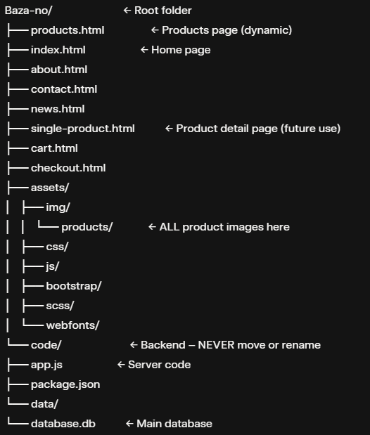

```markdown
# Bazano Website – Complete Change & Maintenance Documentation

**Project Name:** Bazano (بازانو)  
**Current State:** Fully dynamic products page with Node.js + SQLite backend  
**Date:** December 29, 2025  
**Purpose:** This document explains **exactly what developers must do** when making changes to the website — which files to edit, which parts **must never be changed**, and which parts are safe/flexible.

---

## 1. General Rules for Any Change

| Rule | Description |
|------|-------------|
| **DO NOT DELETE** any original design elements (headers, footers, carousels, styles) | The visual design must stay 100% the same |
| **DO NOT MOVE** the `code` folder or `assets` folder | Folder structure must remain exactly as shown |
| **DO NOT CHANGE** file names of main pages (`products.html`, `index.html`, etc.) | Links in menu depend on these names |
| **ALWAYS TEST** after changes: run `npm start` in `/code` and visit `http://localhost:3000/products.html` |

```
---


## 2. Folder Structure (Never Change This Structure)

```
Baza-no/                          ← Root folder
├── products.html                 ← Products page (dynamic)
├── index.html                    ← Home page
├── about.html
├── contact.html
├── news.html
├── single-product.html           ← Product detail page (future use)
├── cart.html
├── checkout.html
├── assets/
│   ├── img/
│   │   └── products/             ← ALL product images here
│   ├── css/
│   ├── js/
│   ├── bootstrap/
│   ├── scss/
│   └── webfonts/
└── code/                         ← Backend – NEVER move or rename
    ├── app.js                    ← Server code
    ├── package.json
    └── data/
        └── database.db           ← Main database
```

---

## 3. What to Change & Where (By Feature)

### A. Adding / Editing / Deleting Products

| Task | What to Do | Where to Change | Must NOT Change |
|------|------------|-----------------|-----------------|
| Add new product | 1. Add row in database<br>2. Add image file | 1. `code/data/database.db` (use DB Browser for SQLite)<br>2. `assets/img/products/product-img-[NEW_ID].jpg` | Do not change existing product IDs |
| Edit product (name, price, brand) | Update the row in database | `code/data/database.db` | Image name stays the same (based on ID) |
| Delete product | Delete the row in database<br>Optional: delete image | `code/data/database.db`<br>Optional: `assets/img/products/product-img-X.jpg` | Do not delete other products |
| Change product image | Replace the image file | `assets/img/products/product-img-[ID].jpg` | File name must stay `product-img-[ID].jpg` |

**Important**: Product ID in database **must match** image filename:  
ID = 15 → Image must be `product-img-15.jpg`

### B. Changing Text / Design (Header, Footer, Menu, etc.)

| Area | Safe to Change? | Where | Notes |
|------|-----------------|-------|-------|
| Logo | Yes | `assets/img/bazano-text-logo.png` | Replace file, keep same name |
| Menu items (text/links) | Yes | All HTML files (header section) | Keep class names like `main-menu` |
| Footer text, address, email | Yes | Footer section in HTML files | Keep structure for responsiveness |
| Main colors, fonts | Yes | `assets/css/main.css` or SCSS files | Do not delete existing rules |
| Page titles, breadcrumb text | Yes | Inside `<h1>` and `<p>` in each HTML file | Example: `<h1>محصولات</h1>` |

**Never delete**: Any `<div>`, `<section>`, or classes used by JavaScript (like `product-lists`, `single-product-item`)

### C. Changing the Products Page Layout

| Change | Can Do? | How |
|-------|--------|-----|
| Change grid (3 columns → 4 columns) | Yes | Edit `col-lg-4` to `col-lg-3` in the script (line: `colDiv.className = ...`) |
| Add description under title | Yes | Add `<p class="product-desc">${product.description}</p>` inside script `innerHTML` |
| Show quantity or stock | Yes | Add badge using `${product.quantity}` |
| Change price text ("قیمت" → "قیمت فروش") | Yes | Edit `<span>قیمت</span>` in script |
| Add sale badge or discount | Yes | Add logic in JavaScript using `price_entry` vs `price_exit` |

**Never delete**:
- `<div id="product-lists-container">`
- The entire `<script>` that loads products (at bottom of `products.html`)

### D. Backend / Server Changes (`code` folder)

| Task | Where | Details |
|------|-------|--------|
| Add new API endpoint | `code/app.js` | Add new `app.get('/api/...')` |
| Change database query | `code/app.js` | Edit the SQL in `/api/products` |
| Add more fields (e.g., discount) | 1. Database<br>2. `app.js`<br>3. Script in HTML | 1. Add column to `products` table<br>2. SELECT it<br>3. Use in frontend |
| Change port | `code/app.js` | Change `const PORT = 3000;` |

**Never delete**:
- `app.use(express.static(...))` → this serves HTML and images
- The database connection code
- `/api/products` endpoint

### E. Adding New Pages

| Task | Steps |
|------|-------|
| Create new page (e.g., `services.html`) | 1. Copy `products.html`<br>2. Rename to `services.html`<br>3. Change content<br>4. Add link in menu (all HTML files) |

Keep header and footer the same across all pages.

---

## 4. What MUST Stay Exactly the Same (Critical Parts)

| Part | Why It Must Not Change |
|------|------------------------|
| `code/app.js` static file serving line | Serves all HTML, CSS, images |
| Image naming: `product-img-[ID].jpg` | Script depends on this exact pattern |
| `id="product-lists-container"` in `products.html` | JavaScript finds this to inject products |
| The dynamic loading `<script>` at bottom of `products.html` | Loads real products from database |
| Header menu structure and classes | Mobile menu and sticky header depend on it |
| Footer structure | Responsiveness and social icons |

---

## 5. Tools Needed for Changes

| Tool | Use |
|------|-----|
| DB Browser for SQLite (free) | Edit `database.db` safely |
| Text editor (VS Code recommended) | Edit HTML, JS, CSS |
| Node.js installed | Run the server |
| Browser (Chrome/Firefox) | Test changes |

---

## 6. Summary: Safe vs Dangerous Changes

| Safe Changes | Dangerous (Don't Do) |
|--------------|-----------------------|
| Add/edit products in database | Delete or rename `code` folder |
| Replace images (keep name) | Delete the dynamic script |
| Change text, colors, fonts | Change `product-lists-container` ID |
| Add new fields to database + script | Delete static file serving line in `app.js` |
| Create new pages | Move `node_modules` outside `code` |

---

**Your website is now professional, dynamic, and easy to maintain.**  
Follow this document → any developer can update it safely without breaking anything.

